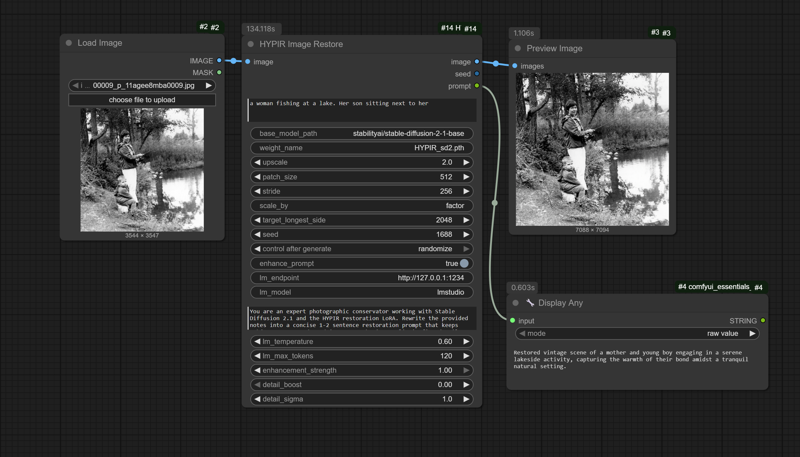
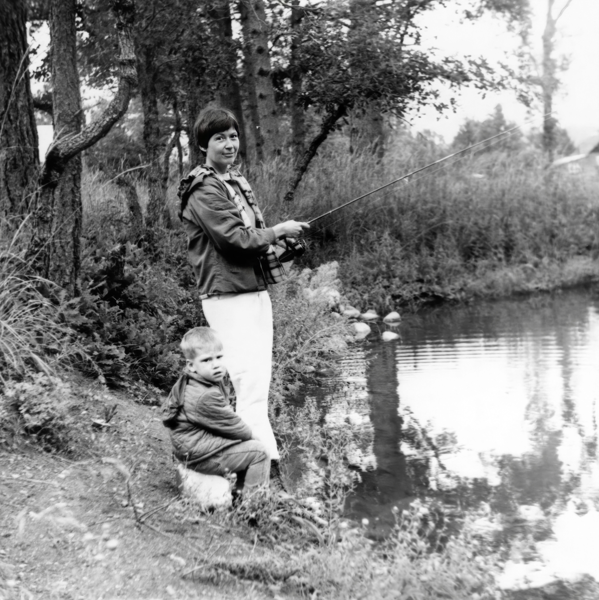

# Hyper-ComfyUI: HYPIR Image Restoration Node

Custom ComfyUI nodes that embed the **HYPIR** image restoration method for
Stable Diffusion 2.1. The upstream research was created by Xinqi Lin,
Fanghua Yu, Jinfan Hu, Zhiyuan You, Wu Shi, Jimmy S. Ren, Jinjin Gu, and
collaborators. Source: <https://github.com/XPixelGroup/HYPIR>.

> **License notice**
> The HYPIR project is released for **non-commercial use only**. This
> repository adopts Eric Hiss's dual-license model (see `LICENSE.md`) and
> redistributes upstream assets under their respective terms. Review all
> license files before using the node in production.

## Installation

### Method 1: Via ComfyUI Manager (Recommended)

1. Install [ComfyUI Manager](https://github.com/ltdrdata/ComfyUI-Manager) if you haven't already
2. Open ComfyUI Manager in ComfyUI
3. Search for "HYPIR" in the Custom Nodes section
4. Click Install
5. Restart ComfyUI

### Method 2: Manual Installation

1. Clone this repository into `ComfyUI/custom_nodes/`:
   ```bash
   cd ComfyUI/custom_nodes
   git clone https://github.com/EricRollei/HYPIR-ComfyUI.git
   ```
2. Restart ComfyUI

## Quick Start

1. After installation, the node will appear in ComfyUI under `Hyper Image Restoration/HYPIR`.
2. **Download HYPIR weights**
   - Grab `HYPIR_sd2.pth` from <https://huggingface.co/lxq007/HYPIR/tree/main>.
   - Place it (and any other LoRA variants) in `HYPIR-ComfyUI/models/`.
3. **Provide Stable Diffusion 2.1 diffusers weights**
   - The node defaults to `stabilityai/stable-diffusion-2-1-base` (512px).
   - For sharper results you can use the 768px repo `stabilityai/stable-diffusion-2-1`.
   - Example offline download:  
     `huggingface-cli download stabilityai/stable-diffusion-2-1 --local-dir "<your path>" --local-dir-use-symlinks False`
   - Point the **base_model_path** input at the chosen folder or keep the repo id to download on demand.
4. Ensure the following Python packages are available (present in recent
   ComfyUI builds): `torch`, `diffusers`, `transformers`, `peft`,
   `accelerate`, `numpy`, `Pillow`, `tqdm`, `requests` (requests is only
   required if you enable LM Studio integration).
5. Restart ComfyUI so the node is discovered.

## Node Overview

| Node | Category | Description |
| ---- | -------- | ----------- |
| `HYPIR Image Restore` | `Hyper Image Restoration/HYPIR` | Restores an input image using the HYPIR LoRA on SD2.1. |

### Core Inputs

- **image** – Tensor from any upstream ComfyUI image node.
- **prompt** – Optional guidance text. Leave empty for prompt-free restoration.
- **base_model_path** – Diffusers-format path or repo id.
- **weight_name** – LoRA filename located in `models/` (dropdown).
- **upscale** – Integer factor applied before restoration (1–8).
- **patch_size / stride** – Tile size and overlap for latent processing.
- **scale_by** – Dropdown with `factor` (default) or `longest_side`. When using `longest_side`, set **target_longest_side**.
- **seed** – Use `-1` for random each run.

### Prompt Enhancement (LM Studio)

- **enhance_prompt** – Toggle to pass the prompt through an OpenAI-compatible LM Studio instance.
- **lm_endpoint** – Base URL of LM Studio (e.g. `http://127.0.0.1:1234`).
- **lm_model** – Model identifier shown in LM Studio.
- **lm_system_prompt** – Defaulted to a conservator-focused template tuned for HYPIR; editable.
- **lm_temperature / lm_max_tokens** – Standard OpenAI parameters for response creativity and length.

When the toggle is on, the node sends your prompt to `/v1/chat/completions`. The LLM is instructed to preserve every subject and cue you provide and only refine wording. The enhanced prompt is returned as a third output and echoed in the console. If the prompt is empty, a short general restoration prompt is generated instead.

### Restoration Controls

- **enhancement_strength** – Blends the HYPIR output with the original image (1 = full restoration, 0.5 = 50/50 mix).
- **detail_boost** – Adds an optional unsharp-mask style detail layer (0–1). Useful for scans that need extra punch.
- **detail_sigma** – Radius (in pixels) for the detail boost blur; higher values influence broader structures.
- **patch_size / stride** – Also impact GPU usage. Larger tiles speed up processing but require more memory.

Internally, the VAE runs with tiled decoding to avoid out-of-memory issues even on very high-resolution inputs.

## Configuring LM Studio

1. Launch LM Studio and enable the **OpenAI Compatible** server.
2. Note the base URL (defaults to `http://127.0.0.1:1234`) and the model identifier shown in the UI.
3. In the node:
   - Set **enhance_prompt** to `True`.
   - Enter the endpoint URL and model name.
   - Optionally tailor the system prompt to match your restoration style.
4. Watch the ComfyUI console: successful calls print `[HYPIR] LM Studio prompt applied: …`. Any failure logs a warning and the original prompt is used.



## File Layout

```text
hyper_comfyui/
├── __init__.py
├── hypir_node.py
├── hypir/
│   ├── __init__.py
│   ├── runtime.py
│   ├── enhancer/
│   │   ├── __init__.py
│   │   ├── base.py
│   │   └── sd2.py
│   └── utils/
│       ├── __init__.py
│       ├── common.py
│       └── tiled_vae/
│           └── __init__.py
└── models/
   └── HYPIR_sd2.pth (place weights here)
```

## Troubleshooting

- **“Missing config.json” errors** – Ensure you are pointing at a *diffusers* copy of SD 2.1. The repo id `stabilityai/stable-diffusion-2-1-base` works out of the box.
- **Out of memory** – Lower `patch_size`, increase `stride`, or set `scale_by = longest_side` with a smaller target.
- **LM Studio not triggering** – Verify the endpoint/model fields, confirm the server is running, and check the console for `[HYPIR]` warnings.

## Attribution

Please cite the original HYPIR paper and repository if you produce results or derivative work. All credit belongs to the authors.

### Example Restoration

- Original scan: 3544 × 3547 px (12.6 MP)
- HYPIR output: 7088 × 7094 px (49 MP) at 2× upscale, processed in ~135 s on an RTX 6000 (Blackwell, 96 GB)

| Source | Preview |
| --- | --- |
| Original film scan |  |
| HYPIR Image Restore |  |
| Photoshop Neural Filter: Photo Restoration |  |
